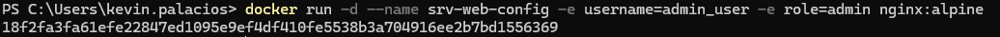
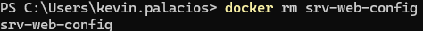
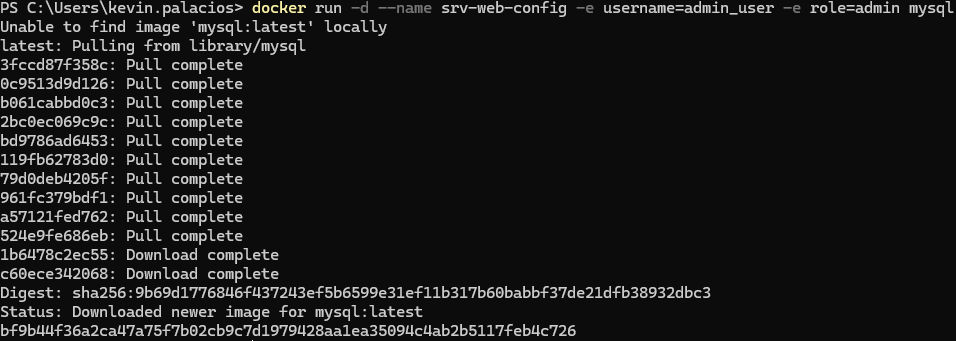
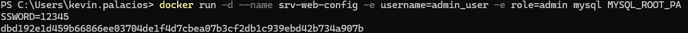
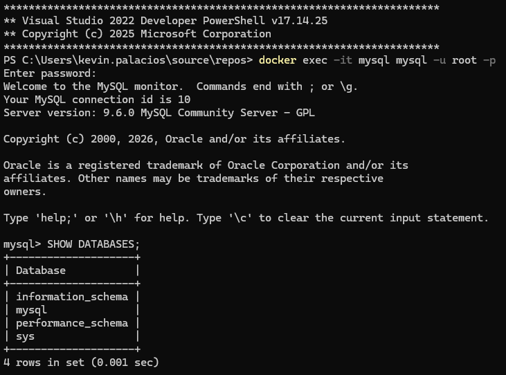

# Variables de Entorno
### ¿Qué son las variables de entorno?
# COMPLETAR
Las variables de entorno son valores definidos en el sistema operativo que influyen en cómo se ejecutan los procesos y programas. Funcionan como un conjunto de pares nombre = valor que el sistema y las aplicaciones pueden consultar para saber configuraciones específicas.

### Para crear un contenedor con variables de entorno

```
docker run -d --name <nombre contenedor> -e <nombre variable1>=<valor1> -e <nombre variable2>=<valor2>
```
porque usar -d y no -p  -d es para que el contenedor se ejecute en segundo plano, mientras que -p es para mapear puertos.
Estás desarrollando una aplicación en un contenedor Docker que se ejecuta en el puerto 5000. Deseas acceder a esta aplicación desde el puerto 5000 de tu máquina host para pruebas de desarrollo. ¿Cuál de los siguientes comandos usarías para iniciar el contenedor con el mapeo de puertos adecuado?

pues seria mejor usar -p 5000:5000
no -d -p en la misma linea porque en ese caso se ejecutaria en primer plano y no en segundo plano.
# COMPLETAR

### Crear un contenedor a partir de la imagen de nginx:alpine con las siguientes variables de entorno: username y role. Para la variable de entorno rol asignar el valor admin.

# COMPLETAR

docker run -d --name srv-web-config -e username=admin_user -e role=admin nginx:alpine

# CAPTURA CON LA COMPROBACIÓN DE LA CREACIÓN DE LAS VARIABLES DE ENTORNO DEL CONTENEDOR ANTERIOR



### Crear un contenedor con la imagen de mysql, mapear todos los puertos
# COMPLETAR
### ¿El contenedor se está ejecutando?
# COMPLETAR

no, se presentan algunos errores.



### Identificar el problema
# COMPLETAR

Puesto que se necesitan credenciales para poder acceder adecuadamente.

MYSQL_ROOT_PASSWORD 

este es el comando que nos permite asignar la contraseña root de mysql.





### Para crear un contenedor con variables de entorno especificadas
- Portabilidad: Las aplicaciones se vuelven más portátiles y pueden ser desplegadas en diferentes entornos (desarrollo, pruebas, producción) simplemente cambiando el archivo de variables de entorno.
- Centralización: Todas las configuraciones importantes se centralizan en un solo lugar, lo que facilita la gestión y auditoría de las configuraciones.
- Consistencia: Asegura que todos los miembros del equipo de desarrollo o los entornos de despliegue utilicen las mismas configuraciones.
- Evitar Exposición en el Código: Mantener variables sensibles como contraseñas, claves API, y tokens fuera del código fuente reduce el riesgo de exposición accidental a través del control de versiones.
- Control de Acceso: Los archivos de variables de entorno pueden ser gestionados con permisos específicos, limitando quién puede ver o modificar la configuración sensible.

### ¿Qué bases de datos existen en el contenedor creado?

docker exec -it <nombre_contenedor> mysql -u root -p

# COMPLETAR
