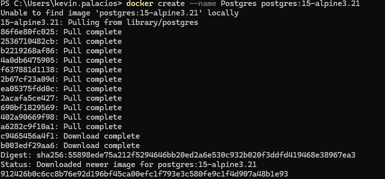
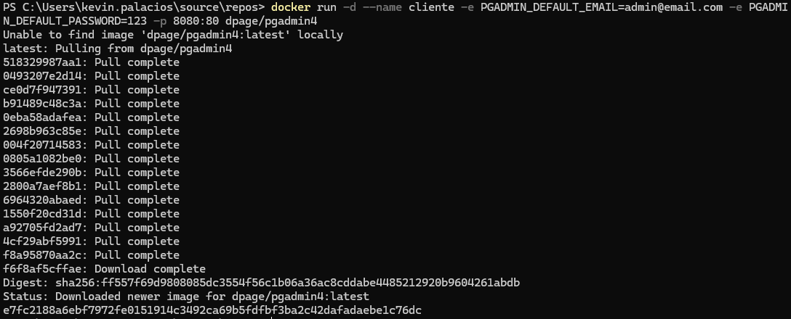
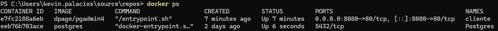
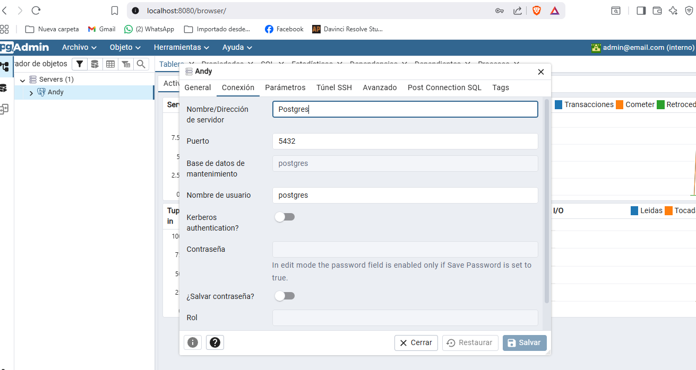
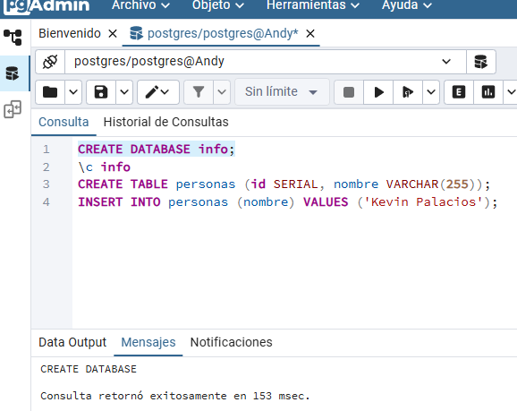
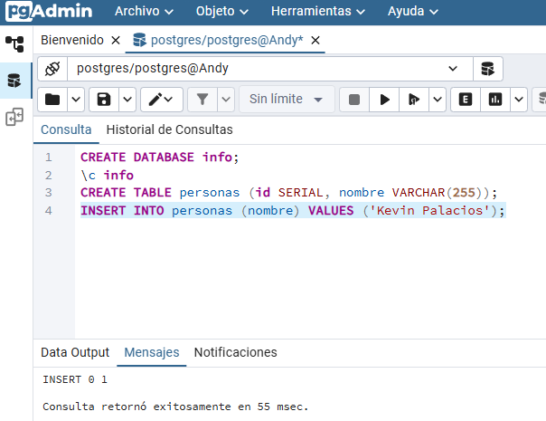
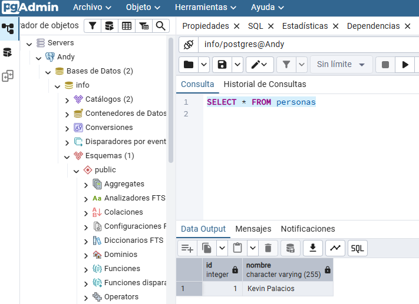

### Crear contenedor de Postgres sin que exponga los puertos. Usar la imagen: postgres:15-alpine3.21
# COMPLETAR

$ docker run --name  -e POSTGRES_PASSWORD=mysecretpassword -d postgres



### Crear un cliente de postgres. Usar la imagen: dpage/pgadmin4

# COMPLETAR

docker run -d --name cliente -e PGADMIN_DEFAULT_EMAIL=admin@email.com -e PGADMIN_DEFAULT_PASSWORD=123 -p 8080:80 dpage/pgadmin4



La figura presenta el esquema creado en donde los puertos son:
los puertos expuestos son:

para saber los puertos expuestos debemos ejecutar el comando: `docker ps` 
a: 8080
b: 80
c: 5432




## Desde el cliente
### Acceder desde el cliente al servidor postgres creado.

para acceder al cliente debemos ir a la siguiente URL: http://localhost:8080

Para acceder al servidor postgres creado, debemos usar las siguientes credenciales:
- Email: admin@email.com
- Password: 123

Una vez que hayamos iniciado sesión, debemos agregar el servidor postgres creado.
Por ejemplo:
Los datos a ingresar son:
- Host name/address: postgres
- Port: 5432
- Maintenance database: postgres
- Username: postgres
- Password: mysecretpassword

si se presentan errores, verificar que el contenedor de postgres esté en ejecución.
Si ambos se estan ejecutando y aun asi no funciona, verificar que el contenedor de postgres esté en la misma red que el cliente.
de la siguiente manera:
```bash
docker network ls
```

# COMPLETAR CON UNA CAPTURA DEL LOGIN


### Crear la base de datos info, y dentro de esa base la tabla personas, con id (serial) y nombre (varchar), agregar un par de registros en la tabla, obligatorio incluir su nombre.

los comandos necesarios para eso son:
```sql
CREATE DATABASE info;
CREATE TABLE personas (id SERIAL, nombre VARCHAR(255));
INSERT INTO personas (nombre) VALUES ('Kevin Palacios');
```




## Desde el servidor postgresl
### Acceder al servidor
### Conectarse a la base de datos info
# COMPLETAR
### Realizar un select *from personas
# AGREGAR UNA CAPTURA DE PANTALLA DEL RESULTADO

