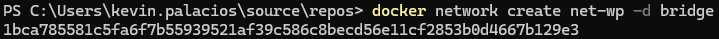
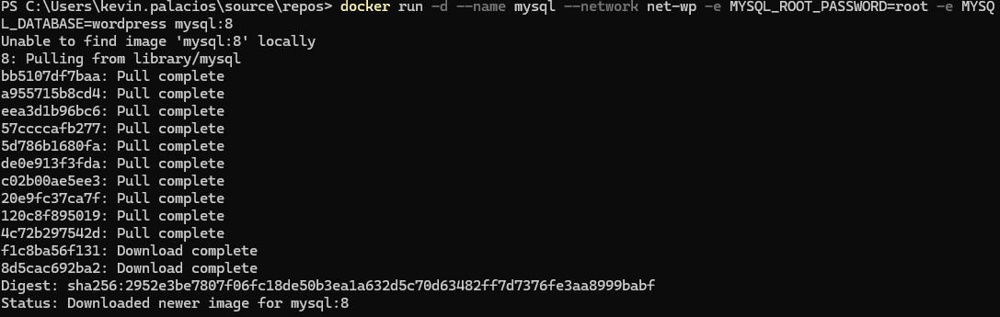
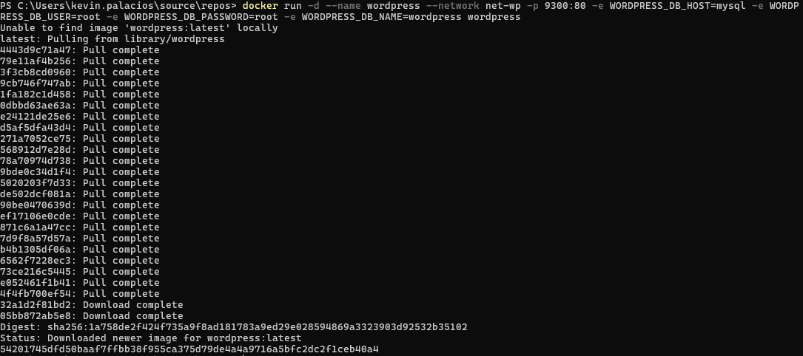
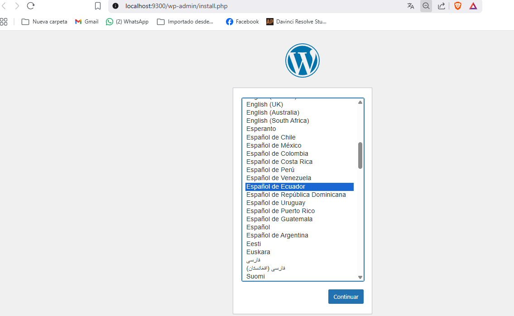
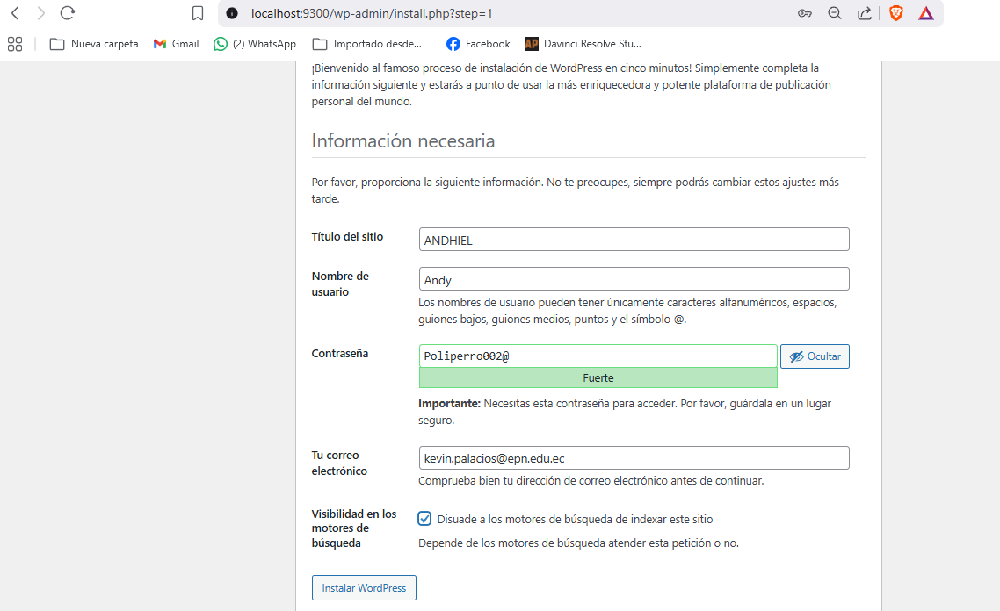
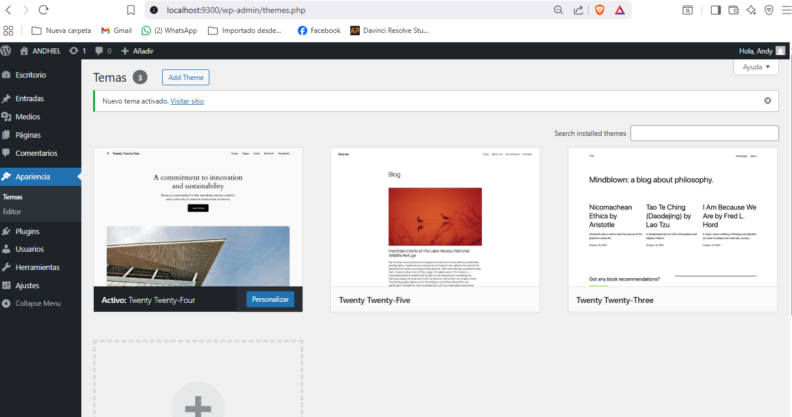
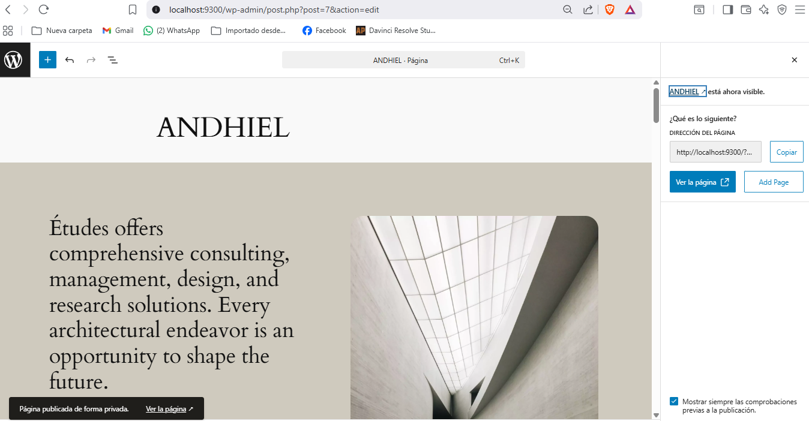
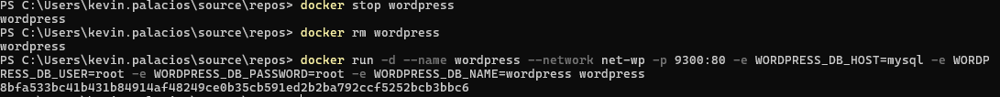
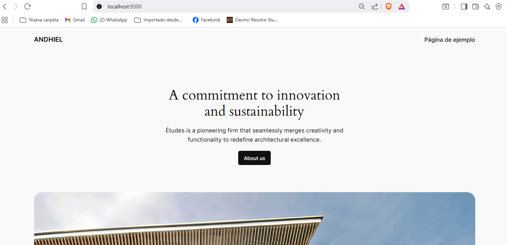

## Esquema para el ejercicio

### Crear la red
# COMPLETAR

docker network create net-wp -d bridge

### Crear el contenedor mysql a partir de la imagen mysql:8, configurar las variables de entorno necesarias
# COMPLETAR

se usa el comando `docker run -d --name mysql --network net-wp -e MYSQL_ROOT_PASSWORD=root -e MYSQL_DATABASE=wordpress mysql:8`

### Crear el contenedor wordpress a partir de la imagen: wordpress, configurar las variables de entorno necesarias
# COMPLETAR

se usa el comando `docker run -d --name wordpress --network net-wp -p 9300:80 -e WORDPRESS_DB_HOST=mysql -e WORDPRESS_DB_USER=root -e WORDPRESS_DB_PASSWORD=root -e WORDPRESS_DB_NAME=wordpress wordpress`

De acuerdo con el trabajo realizado, en el esquema del ejercicio el puerto a es **9300**

Ingresar desde el navegador al wordpress y finalizar la configuración de instalación.
 
# COLOCAR UNA CAPTURA DE LA CONFIGURACIÓN

Desde el panel de admin: cambiar el tema y crear una nueva publicación.
Ingresar a: http://localhost:9300/ 
recordar que a es el puerto que usó para el mapeo con wordpress
# COLOCAR UNA CAPTURA DEL SITIO EN DONDE SEA VISIBLE LA PUBLICACIÓN.

### Eliminar el contenedor wordpress
# COMPLETAR

### Crear nuevamente el contenedor wordpress
Ingresar a: http://localhost:9300/ 
recordar que a es el puerto que usó para el mapeo con wordpress

### ¿Qué ha sucedido, qué puede observar?
# COMPLETAR

Por alguna razón, la publicación no se mantuvo, lo que indica que los datos no se persisten en el contenedor wordpress.
Pero si esta logueado, lo que indica que los datos de sesión se mantienen.